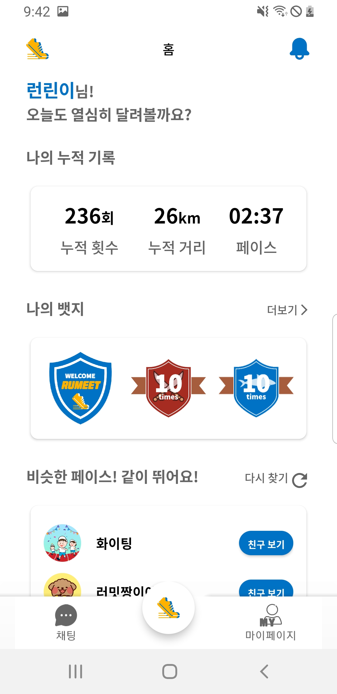
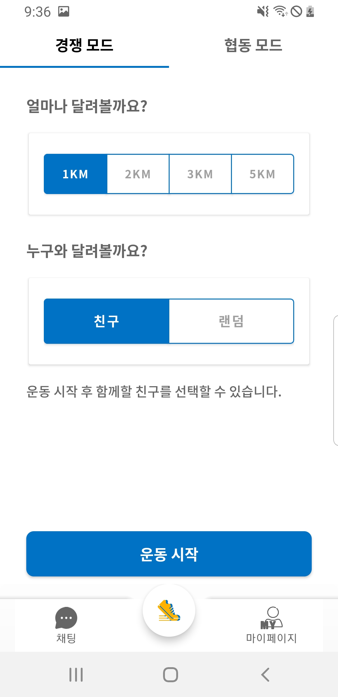
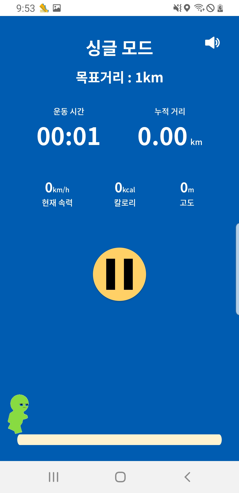
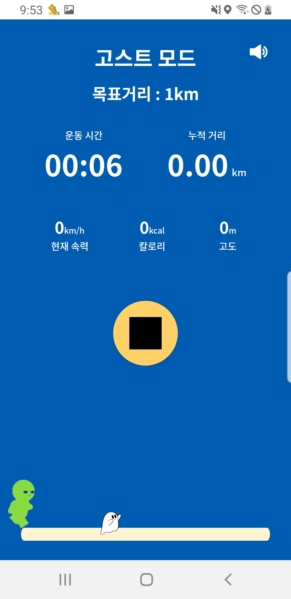
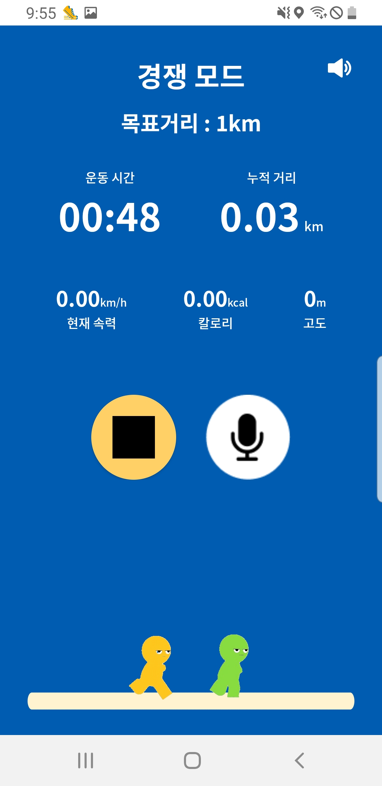
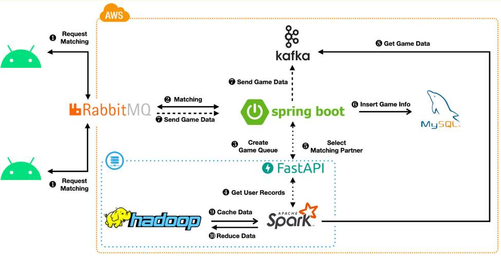

# 👩‍🏫 함께하는 달리기, 러밋

함께 달리는 비대면 러닝 매칭 서비스

---

기존의 많은 러닝앱이 있지만, 혼자만의 기록 관리 위주라 재미있게, 친구와 함께 러닝 할 수 있는 서비스를 고민했습니다. 

러밋은 러닝 기록을 기반으로 나와 체력이 비슷한 유저를 매칭합니다.

친구 혹은 매칭된 유저와 협동, 경쟁 달리기를 하면서 재미있게 함께 러닝 할 수 있는 서비스를 구현하였습니다.

## 🤔 프로젝트 소개

---

- 프로젝트 기간 및 인원
  
    SSAFY 특화 프로젝트 23. 02 ~ 23. 04 (7주)
  
    BE 4명, FE 2명 - 백엔드 담당

- 기획 배경
  - 🙅‍♂️ **러닝, 왜 오랫동안 지속하지 못할까요?**
    - 함께 달릴 **러닝메이트**가 없어 힘들어요
    - 친구와 함께 운동하고 싶지만 **만나기 힘들어요**
    - 러닝을 하고 싶은데 **재미가 없어요**
  - 🙆‍♂️ **러밋은 이렇게 해결했어요!**
    - 나와 **체력이 비슷한 러닝메이트**를 추천해줘요
    - 실시간으로 기록을 공유하며 **멀리서도 함께 달릴 수 있어요**
    - 고스트, 경쟁, 협동과 같은 **게임 모드**를 통해 재밌는 러닝을 제공해요

## ⭐ 기능 소개

---

### 서비스 핵심 기능

- **나만의 러닝 메이트 찾기**

- **모드 선택**
  
  

- **솔로, 고스트, 경쟁, 협동 달리기**
  
  
  
  
   
  
  
   

        

### 서비스 전체 기능

- **나만의 러닝 메이트 추천** - 나의 체력 기반으로 가장 알맞는 러닝 메이트를 추천합니다.
- **뱃지** - 러닝 참여도에 따른 뱃지를 받을 수 있습니다.
- **채팅** - 채팅을 주고 받을 수 있습니다.
- **친구** - 친구와의 매칭을 보내고 채팅을 사용할 수 있습니다.
- **나의 운동, 매칭 기록 보기** - 나의 과거 운동 기록과 매칭 기록을 볼 수 있습니다.
- **싱글 달리기** - 혼자서 1/2/3/5km를 정해 달릴 수 있습니다.
- **고스트 달리기** - 나의 과거 기록 또는 친구의 기록으로 달릴 수 있습니다.
- **경쟁 달리기** - 랜덤 혹은 친구와 함께 달리며 정해진 거리를 먼저 도달하면 승리합니다.
- **협동 달리기** - 랜덤 혹은 친구와 함게 달리며 정해진 난이도의 상어에게 도망가면 승리합니다.

## 👩🏻‍🔧 기술 스택

---

- **FE**
  
    👨‍💻 **투입인원** : 2명
  
    👨‍💻 **사용 OS** : Android
  
    📒 **주요기술**
  
  - Architecture: Clean Architecture + MVVM + Single Activity
  - Denpendcy Injection: Hilt
  - Asynchronous Task Manager: Flow + Coroutine
  - Language: Kotlin

- **BE**
  
    👨‍💻 **투입인원** : 4명
  
    👨‍💻 **Web Application Framework**: Spring boot
  
    📒 **주요기술**
  
  - Database: MySQL, MongoDB, hadoop
  - Langugage: Java
  - Web Server: AWS EC2
  - Kafka, Spark Streaming, hadoop, rabbitMQ

## 🔧 프로젝트 아키텍처

---

데이터 처리 설계
